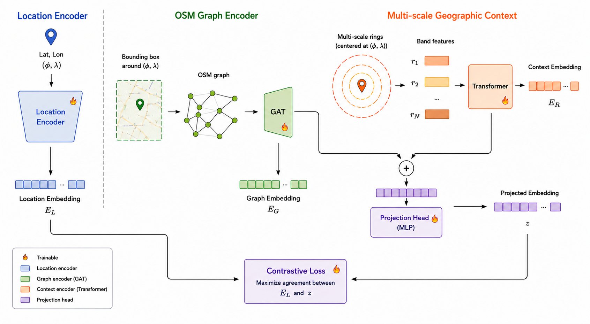

# OSMGraphCLIP: Learning Global Location Representations from OpenStreetMap Graphs

[](https://arxiv.org/abs/2606.08046)

**OSMGraphCLIP** is a CLIP-style contrastive model that learns joint embeddings of OpenStreetMap (OSM) heterogeneous graphs and geographic coordinates, producing a global location encoder.

The model is trained by aligning two encoders:
- a **graph encoder** (`OSMHeteroGAT`) that processes a heterogeneous OSM graph (points, lines, polygons with CLIP/SBERT node features) at a given location, and
- a **location encoder** (`LocationEncoder`) that maps geographic coordinates through spherical-harmonic positional encodings and a SIREN network.

Contrastive training with symmetric cross-entropy drives matching (graph, coordinate) pairs to similar embeddings. The location encoder alone is sufficient for inference — no OSM data is needed at query time.

## Method



## Pretrained models

Pretrained checkpoints are available on HuggingFace under `d-michail/`:

| Model | HuggingFace | Legendre polys | Multiscale bands |
|---|---|---|---|
| OSMGraphCLIP-MS-L40 | [d-michail/OSMGraphCLIP-MS-L40](https://huggingface.co/d-michail/OSMGraphCLIP-MS-L40) | 40 | yes |
| OSMGraphCLIP-MS-L10 | [d-michail/OSMGraphCLIP-MS-L10](https://huggingface.co/d-michail/OSMGraphCLIP-MS-L10) | 10 | yes |
| OSMGraphCLIP-A-L40 | [d-michail/OSMGraphCLIP-A-L40](https://huggingface.co/d-michail/OSMGraphCLIP-A-L40) | 40 | no |
| OSMGraphCLIP-A-L10 | [d-michail/OSMGraphCLIP-A-L10](https://huggingface.co/d-michail/OSMGraphCLIP-A-L10) | 10 | no |

## Training dataset

The pretrained encoders were trained on a dataset of approximately 200k globally-diverse locations. The training locations are available in this repository:

- `data/satclip_locations.csv` — primary location set
- `data/h3_locations.csv` — globally-diverse H3-sampled locations

The full dataset used to train the MS variants (multi-scale OSM graphs paired with coordinates) is available on HuggingFace: [d-michail/OSMGraphCLIP-MS](https://huggingface.co/datasets/d-michail/OSMGraphCLIP-MS).

## Install

```bash
python -m venv .venv
source .venv/bin/activate
pip install -r requirements.txt
```

For inference only (lighter install):

```bash
pip install -r requirements_inf.txt
```

## Quick usage

### Inference

Encode a single `(lat, lon)` coordinate with a pretrained model from HuggingFace Hub or a local checkpoint:

```bash
# HuggingFace Hub (downloads on first call, then uses local cache)
python infer.py --hf-model osmgraphclip-ms-l40 --lat 52.52 --lon 13.40

# Lightweight loader (skips graph encoder — faster)
python infer.py --hf-model osmgraphclip-ms-l40 --lat 52.52 --lon 13.40 --lightweight

# JSON output saved to file
python infer.py --hf-model osmgraphclip-ms-l40 --lat 52.52 --lon 13.40 \
    --format json --output embedding.json

# Local checkpoint
python infer.py --ckpt path/to/checkpoint.ckpt --lat 52.52 --lon 13.40
```

**Python API**:

```python
from osmgraphclip.load import get_osmgraphclip_from_hf

# Returns LocationEncoder only (default) — no OSM data needed at query time
location_encoder = get_osmgraphclip_from_hf("osmgraphclip-ms-l40", device="cpu")

# coords: (lon, lat) order, shape [N, 2], float64
import torch
coords = torch.tensor([[-0.1276, 51.5074]], dtype=torch.float64)
embedding = location_encoder(coords)
```

> **Note**: coordinates are passed in `(lon, lat)` order.

### Build a dataset and train

Dataset creation is a two-step process:

```bash
# 1. Download OSM data for a set of locations
python create_dataset.py \
  --output-dir my_dataset \
  --locations-file data/satclip_locations.csv \
  --bbox-size 250

# 2. Build graph pickles (SBERT 384-dim node features)
python create_graphs.py \
  --output-dir my_dataset \
  --embedding-backend sbert

# 3. Train
python train.py --config configs/default.yaml
```

See `AGENTS.md` for the full flag reference for all scripts.

## What is in this repo

- `create_dataset.py` — downloads OSM GeoJSON files and populates `dataset.db`
- `create_graphs.py` — builds heterogeneous graph pickles from GeoJSON files
- `create_multiscale_dataset.py` — downloads fine-grain OSM data and extracts multi-scale concentric-ring (band) features
- `create_h3_locations.py` — generates a globally-diverse CSV of training locations via H3 + PostGIS
- `create_litdata_dataset.py` — converts a graph-pickle dataset to LitData streaming chunks
- `infer.py` — encodes a single `(lat, lon)` with a trained or HuggingFace checkpoint
- `train.py` — LightningCLI training entry point
- `osmgraphclip/` — core model, loss, data modules, OSM graph builders, positional encoders, and band feature extractor

## Citation

```bibtex
@misc{michail2026osmgraphcliplearninggloballocation,
      title={OSMGraphCLIP: Learning Global Location Representations from OpenStreetMap Graphs}, 
      author={Dimitrios Michail and Eleni Saka and Ioannis Giannopoulos and Ioannis Papoutsis},
      year={2026},
      eprint={2606.08046},
      archivePrefix={arXiv},
      primaryClass={cs.AI},
      url={https://arxiv.org/abs/2606.08046}, 
}
```

## Acknowledgements

The OSM graph construction code (`osmgraphclip/osm_to_graph.py`) is adapted from [GeoLink](https://github.com/bailubin/GeoLink_NeurIPS2025).
Location encoder code is adapted from [SatCLIP](https://github.com/microsoft/satclip).

## Current caveats

- First graph build may be slow: `OSM2Graph` downloads model weights from HuggingFace on first use (`all-MiniLM-L6-v2` for the default SBERT backend).
- Large runs are long-running (thousands of samples). Prefer resumable mode (default `--resume`) so interrupted runs can continue.
- `node_embedding_dim` in `configs/default.yaml` must match the embedding backend used at dataset creation time (384 for `all-MiniLM-L6-v2`, 768 for `all-mpnet-base-v2`, 512 for CLIP).
- OSM data can be fetched via the public Overpass API (`--backend overpass`, default) or a local PostGIS database (`--backend postgis --postgis-url ...`). The Overpass API is considerably slower and subject to rate limits; a local PostGIS instance is strongly recommended for large-scale dataset builds.
